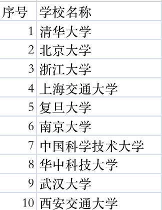

# 中国教育数据项目-说明文档

***version: 2023-01-05***

[TOC]

本文档对中国教育数据项目的整体流程进行说明，并附带部分数据和操作样例，章节安排如下：

- **第一章-高等教育数据收集**

- **第二章-中等教育数据收集**

- **第三章-教育集团数据收集**

- **第四章-校外教培数据收集**

- **第五章-贡献者与鸣谢名单**

前四章依次介绍了高等教育、中等教育、教育集团、校外教培的数据收集流程，每章介绍的主要内容有：

- *数据源清单*

- *数据收集流程图*

- *各数据源的数据获取流程*

- *数据宽表构建*

- *数据补全计划*

第五章列出了在数据收集工作中提供了各类帮助的人员名单。

## 1 高等教育数据收集

高等教育数据收集的内容位于“数据收集-高等教育”文件夹内，由六部分构成，如下：

1. “数据源”文件夹，其中分类汇总了各数据源获取到的原始数据，以及数据源清单；

2. “数据收集流程”文件夹，内容包含高等教育数据收集的流程图；

3. “中间结果”文件夹，用于保存数据合并过程中的一些中间结果，方便人工核验数据质量和准确性；

4. “数据宽表”文件夹，保存了当前各数据源的数据依照数据收集流程整理合并后得到的完整数据宽表；

5. “补全计划”文件夹，存放了人工已完成和计划收集并补全数据宽表中缺失信息的各类数据；

6. “高等教育宽表构建.ipynb”，是进行数据处理和得到高等教育数据宽表的python代码。

### 1.1 高等教育数据源清单

高等教育数据收集过程中积累的数据源信息，汇总成表格 **高等教育数据源清单.csv**：

每个数据源包括的信息有：

- 数据源名称

- 数据源类型（当前分为学校名单、分类名单、综合信息、经费预算四类）

- 数据来源

- 数据涉及地区（全国或特定省市等）

- 数据源内容说明

- 数据源网址链接

### 1.2 高等教育数据收集流程图

高等教育数据收集的流程主要由五部分构成：

- 以教育部公布名单为基础构建全国高等学校名单

- 各种高校分类名单信息收集与整合

- 各高校综合信息收集与整合

- 头部高校经费数据收集

- 缺失数据增补

流程图如下：

### 1.3 各数据源的数据获取流程

#### 1.3.1 学校名单

##### 1.3.1.1 教育部-全国高等学校名单

访问 [教育部-全国高等学校名单](http://www.moe.gov.cn/jyb_xxgk/s5743/s5744/A03/202206/t20220617_638352.html) 页面：

可以直接下载到两份名单：

- [全国普通高等学校名单](http://www.moe.gov.cn/jyb_xxgk/s5743/s5744/A03/202206/W020221128575365987397.xls)

- [全国成人高等学校名单](http://www.moe.gov.cn/jyb_xxgk/s5743/s5744/A03/202206/W020220617499137882559.xls)

整理后得到两份数据表：

- **全国普通高等学校名单.csv**
  
  

- **全国成人高等学校名单.csv**
  
  

##### 1.3.1.2 学校名单补充

对于教育部名单中未收录的部分学校，在收集过程中建立了补充名单 **人工增补-学校名单补充.csv**：

名单中除学校名称外，还通过查询对应学校的百度百科词条，补充了五个字段：

- 主管部门

- 所在省份

- 所在城市

- 办学层次

- 学校性质

#### 1.3.2 分类名单

##### 1.3.2.1 掌上高考-各类名单

访问 [掌上高考-查学校页面](https://www.gaokao.cn/school/search)

在“院校大全”搜索设置中的“院校特色”选项下，分别选择红框中的标签分类，可以得到双一流、教务部直属、中央部委直属、强基计划、双高计划五类学校的名单。整理每类名单后，得到五份数据表：

- **掌上高考-双一流学校名单.csv**
  
  

- **掌上高考-教育部直属学校名单.csv**
  
  

- **掌上高考-中央部委直属学校名单.csv**
  
  

- **掌上高考-强基计划学校名单.csv**
  
  

- **掌上高考-双高计划学校名单.csv**
  
  

##### 1.3.2.2 中国教育在线-各类名单

访问 [中国教育在线-大学信息查询](https://www.zhijiao.cn/mingdan.shtml) 页面：

选择对应的名单分类，可查询相应的高校列表。以“第一轮双一流大学”为例，点击进入 [“第一轮双一流”建设高校及建设学科名单](https://www.zhijiao.cn/syl.shtml) 页面：

可以查到对应的名单信息，整理后得到数据表 **中国教育在线-第一轮双一流大学名单.csv**：

按照类似的方法，整理得到以下数据表：

- **中国教育在线-第二轮双一流大学名单.csv**
  
  

- **中国教育在线-国家骨干高职院校名单.csv**
  
  

- **中国教育在线-国家示范性高职院校名单.csv**
  
  

- **中国教育在线-中外合作办学名单.csv**
  
  

##### 1.3.2.3 百家号-985高校入选时间批次

访问 [39所985高校入选时间](https://baijiahao.baidu.com/s?id=1747373085036941612&wfr=spider&for=pc) 页面：

可以找到各985高校的入选时间，整理后得到数据表 **百家号-985高校入选时间批次汇总.csv**：

##### 1.3.2.4 高考资讯网-985工程高校实力划分

访问 [高考资讯网-985工程高校批次名单及实力划分](https://www.imrtvu.com/gklq/19372.html) 页面：

可以找到985工程高校评选批次名单和实力梯队分类信息

整理后得到数据表 **高考资讯网-985工程高校批次名单及实力划分.csv**：

##### 1.3.2.5 腾讯新闻-新一轮双一流计划学科分类

访问 [腾讯新闻-新一轮双一流计划名单](https://view.inews.qq.com/a/20220210A01S6700) 页面：

可以找到2021-2025年“双一流”建设高校名单（建议稿）内容，整理后得到数据表 **腾讯新闻-新一轮双一流计划名单.xlsx**：

#### 1.3.3 综合信息

##### 1.3.3.1 掌上高考-学校概况

在 [掌上高考-查学校页面](https://www.gaokao.cn/school/search) 的搜索框中直接输入需要查询的学校名称（下文以“厦门大学为例”），点击进入搜索到的学校介绍页面：

从页面抬头信息栏的红框区域，可以得到下列信息：

- 所在省份

- 所在城市

- 办学层次

- 学校类型

- 学校性质

- 各类属性标签（如211工程、985工程、双一流等）

- 学校官网

在同页面下方的“基本信息”栏中，可以得到的信息有：

- 创建时间

- 占地面积（亩）

- 主管单位

- 学校地址

将各学校以上信息和通过其他数据源查找补全的信息汇总后，整理得到全国高校的基本信息表 **掌上高考-学校综合信息表**：

#### 1.3.4 经费预算

##### 1.3.4.1 青塔-2022年预算经费

访问 [2022年全国高校预算经费汇总](https://www.maigoo.com/news/627063.html) 页面：

可以找到各学校2022年的预算总收入和本年度收入统计，整理后得到数据表 **青塔-2022年全国高校预算经费汇总.xlsx**：

##### 1.3.4.2 聚汇数据-2022年财政拨款

访问 [聚汇数据-2022年中央部署高校财政拨款排名表](https://edu.gotohui.com/list/177516.html) 页面：

可以找到各中央部署高校2022年的财政拨款统计情况，整理后得到数据表 **聚汇数据-2022年中央部署高校财政拨款统计.xlsx**：

### 1.4 高等教育宽表构建

运行 ***高等教育宽表构建.ipynb*** 中的代码，进行全部数据的合并，得到 **高等教育数据宽表.csv**：

数据处理与合并过程中应用的方法与逻辑，已在代码中通过逐行注释的方式进行呈现，构成本文档的一部分补充内容，在文档正文中不再占用过多篇幅进行展开介绍。

宽表中各字段的含义和数据样例，可参考 **高等教育数据宽表字段说明.csv**：

### 1.5 数据补全

当前已完成的数据补全如下：

#### 1.5.1 学校综合信息补全v20221213

对现有宽表中缺失信息较多的高校，从其他数据源查找和补全缺少的字段，得到数据表 **学校综合信息补全v20221209_LJJ_20221213.xlsx**：

表中信息已补充至当前最新版本的高等教育数据宽表中。

**Note: 后续章节内容待更新至最新版本，仅供参考**

## 2 中等教育数据收集

### 2.1 中等教育数据源清单

中学数据收集过程中积累的数据源信息，汇总成表格 **中学数据源清单.xlsx**：

其中内容包括：

- 数据源名称

- 数据来源

- 数据涉及地区

- 数据内容说明

- 数据网址链接

### 2.2 中等教育数据收集流程图

中等教育数据收集的流程主要由三部分构成：

- 构建头部学校名单

- 补充其他学校和更多字段信息

- 缺失数据增补

流程示意图如下：

### 2.3 各数据源的数据获取流程

中等教育各数据源的数据获取流程如下：

#### 2.3.1 全国/各省中学排名

##### 2.3.1.1 出国留学网-全国高中排名100强

访问 [出国留学网-全国高中排名](https://www.liuxue86.com/k_%E5%85%A8%E5%9B%BD%E9%AB%98%E4%B8%AD%E6%8E%92%E5%90%8D/) 页面：

整理后得到数据表 **出国留学网-全国高中排名100强.xlsx**：

##### 2.3.1.2 个人图书馆-全国高中排名名单

访问 [个人图书馆-2022中国高中排名](http://www.360doc.com/content/22/0825/13/17747993_1045237937.shtm) 页面：

整理后得到数据表 **个人图书馆-全国高中排名名单.xlsx**：

##### 2.3.1.3 郁金香-全国各省市地区重点高中前十排名

访问 [郁金香-全国各省市地区重点高中前十排名](https://www.yjxdezx.com/b/183089.html) 页面：

整理后得到数据表 **郁金香-全国各省市地区重点高中前十排名.xlsx**：

##### 2.3.1.4 中职招生网-全国31省市高中TOP5名单

访问 [中职招生网-中国百强中学排名](https://www.wd-purchase.com/zxzx/6652.html) 页面：

整理后得到数据表 **中职招生网-全国31省市高中TOP5名单.xlsx**：

##### 2.3.1.5 买购网-各省top10中学名单

以广东省为例，访问 [买购网-广东十大高中排行榜](https://www.maigoo.com/top/400728.html) 页面：

按相同逻辑，逐个收集整理各省top10高中，各省对应的数据源和网页链接见“中学数据源清单”，最终得到数据表 **各省top10中学名单.xlsx**：

##### 2.3.1.6 买购网-全国16所能保送的外国语学校排行榜

访问 [买购网-全国16所能保送的外国语学校排行榜](https://www.maigoo.com/top/419496.html) 页面：

整理后得到数据表 **全国16所能保送的外国语学校排行榜.xlsx**：

##### 2.3.1.7 买购网-中国十大国际高中学校排名

访问 [买购网-中国十大国际高中学校排名](https://www.maigoo.com/top/417099.html) 页面：

整理后得到数据表 **中国十大国际高中学校排名.xlsx**：

#### 2.3.2 全国中学基本信息

##### 2.3.2.1 我要搜学网

访问 [我要搜学网-全国中学学校列表](http://xuexiao.51sxue.com/slist/?t=3&areaCodeS=) 页面：

列表中的每所学校，可以得到的信息包括：

- 学校名称

- 地区

- 属性

- 性质

- 类型

- 学校地址

- 联系电话

整理列表中的全部学校信息后，得到数据表 **我要搜学网-中学信息表.csv**：

在相同页面下，“筛选条件-学校类型”选项中改选“职业中学”，可以得到全国职业学校的信息：

整理后得到数据表 **我要搜学网-职业学校信息表.csv**：

##### 2.3.2.2 学校大全

以北京市为例，访问 [学校大全-北京高中大全](http://beijing.xuexiaodaquan.com/gaozhong/)：

该页面下可以获得的信息包括：

- 学校名称

- 地址

- 电话

- 网址

其他省份/直辖市的学校信息按照类似方式查询，整理后得到数据表 **学校大全-全国高中信息表.csv**：

在相同页面下，将筛选条件中的“类型”改为“北京初中”，可以获取北京的初中大全信息：

其他省份/直辖市的学校信息按照类似方式查询，整理后得到数据表 **学校大全-全国初中信息表.csv**：

### 2.4 中等教育宽表构建

使用 ***中学宽表构建.ipynb*** 的代码，进行全部数据的合并，得到 **中学数据宽表.xlsx**：

数据处理与合并过程中应用的方法与逻辑，已在代码中通过逐行注释的方式进行呈现，构成本文档的一部分补充内容，在文档正文中不再占用过多篇幅进行展开介绍。

宽表中各字段的含义和数据样例，可参考 **中学数据宽表字段说明.xlsx**：

### 2.5 数据补全

当前已完成的数据补全如下：

#### 2.5.1 中学信息补全v20221213

对现有宽表中缺失信息较多的100+学校，从其他数据源查找和补全缺少的字段，得到数据表 **中学信息补全v20221213.xlsx**：

#### 2.5.2 中学官网数据补全v20221220

对头部中学里缺少官网信息的学校，从其他数据源进行搜索补充，得到数据表 **中学官网数据补全v20221220.csv**：

## 3 教育集团数据收集

### 3.1 教育集团数据源清单

教育集团数据收集过程中积累的数据源信息，汇总成表格 **教育集团数据源清单.xlsx**：

其中内容包括：

- 数据源名称

- 数据来源

- 数据涉及地区

- 数据内容说明

- 数据网址链接

### 3.2 教育集团数据收集流程图

教育集团数据收集的流程主要由三部分构成：

- 头部职业教育集团信息收集

- 头部基础教育集团信息收集

- 教育集团缺失数据增补

流程示意图如下：

### 3.3 各数据源的数据获取流程

教育集团各数据源的数据获取流程如下：

#### 3.3.1 职业教育集团名单

访问教育部官网的两个通知页面：

- [关于公布第一批示范性职业教育集团（联盟）培育单位名单的通知](http://www.moe.gov.cn/s78/A07/A07_sjhj/202010/t20201016_495041.html)
  
  

- [关于公布第二批示范性职业教育集团（联盟）培育单位名单的通知](http://www.moe.gov.cn/s78/A07/A07_sjhj/202106/t20210607_536268.html)
  
  

可以下载得到两份数据表：

- **第一批示范性职业教育集团（联盟）培育单位名单.xlsx**
  
  

- **第二批示范性职业教育集团（联盟）培育单位名单.xls**
  
  

合并后得到完成的头部职业教育集团名单。

#### 3.3.2 基础教育集团名单

通过查找各省市教育厅或政府部门公告，寻找基础教育集团的名单信息。以广东省为例，访问 [广东省教育厅网站-关于省级优质基础教育集团培育对象名单的公示](http://edu.gd.gov.cn/zwgknew/gsgg/content/post_3720723.html) 页面：

可以下载得到 [省级优质基础教育集团培育对象名单.docx](http://edu.gd.gov.cn/attachment/0/476/476904/3720723.docx)：

整理并补充更多字段信息后，得到数据表 **基础+职业教育集团信息补全_YS_20221214.xlsx**：

其他省市的基础教育集团信息按照类似流程进行收集整理。

### 3.4 教育集团宽表构建

使用 ***教育集团宽表构建.ipynb*** 的代码，进行全部数据的合并，得到 **教育集团数据宽表.xlsx**：

数据处理与合并过程中应用的方法与逻辑，已在代码中通过逐行注释的方式进行呈现，构成本文档的一部分补充内容，在文档正文中不再占用过多篇幅进行展开介绍。

宽表中各字段的含义和数据样例，可参考 **教育集团数据宽表字段说明.xlsx**：

### 3.5 数据补全

当前已完成的数据补全如下：

#### 3.5.1 职业教育集团信息补全_LJJ_20221215

对现有宽表中缺失成员信息的职业教育集团，从其他数据源查找和补全缺少的字段，得到数据表 **职业教育集团信息补全_LJJ_20221215.xlsx**：

#### 3.5.2 基础教育集团信息补全_LJJ_20221216

对现有宽表中缺失成员信息的基础教育集团，从其他数据源查找和补全缺少的字段，得到数据表 **基础教育集团信息补全_LJJ_20221216.xlsx**：

## 4 校外教培数据收集

### 4.1 校外教培数据源清单

校外教培数据收集过程中积累的数据源信息，汇总成表格 **校外教培数据源清单.xlsx**：

其中内容包括：

- 数据源名称

- 数据来源

- 数据涉及地区

- 数据内容说明

- 数据网址链接

### 4.2 校外教培数据收集流程图

校外教培数据收集的流程主要由三部分构成：

- 教培机构信息收集

- 教培品牌信息收集

- 缺失信息人工补全

流程示意图如下：

### 4.3 各数据源的数据获取流程

校外教培各数据源的数据获取流程如下：

#### 4.3.1 教育部校外培训机构名单

访问 [全国校外教育培训监管与服务综合平台-机构查询](https://xwpx.eduyun.cn/bmp-web/tolSpInfo/index) 页面：

可以按照区域、培训形式、培训类型等筛选条件查询机构信息：

从查询结果中，能够收集到的信息包括：

- 培训机构名称

- 区域

- 培训形式

- 培训类型

- 学段

- 执照

- 办学许可证

按不同省份/直辖市整理后得到一批数据表  **教培大全_省/市名称.xlsx**：

#### 4.3.2 我要搜学网-培训机构信息表

访问 [我要搜学网-全国培训机构学校列表](http://xuexiao.51sxue.com/slist/?t=5&areaCodeS=) 页面：

列表中能够获取到的信息包括：

- 培训机构名称

- 地区

- 属性

- 性质

- 类型

- 学校地址

- 联系电话

整理后得到数据表 **我要搜学网-培训机构信息表.csv**：

#### 4.3.3 学校大全-培训机构信息表

以北京市为例，访问 [学校大全-北京培训机构大全](http://beijing.xuexiaodaquan.com/peixunjigou/) 页面：

从收录的培训机构列表中，可以获得的信息有：

- 培训机构名称

- 地址

- 电话

- 网址

其他省市的培训机构大全按类似流程获取，整理后得到数据表 **学校大全-培训机构信息表.csv**：

#### 4.3.4 买购网-各类教培品牌榜单

##### 4.3.4.1 民办培训品牌大全

访问 [买购网-品牌大全-民办培训](https://www.maigoo.com/brand/search/?catid=1707) 页面：

从对应搜索结果列表中，可以获得的信息有：

- 民办培训品牌名称

- 品牌类型

- 所属公司

- 品牌的买购网链接

- 品牌简介

整理后得到数据表 **买购网-教培品牌大全.xlsx**：

##### 4.3.4.2 教培品牌细分类top10名单

访问 [买购网-2022教育培训机构十大品牌排行榜](https://www.maigoo.com/best/15520.html) 页面：

以”考研培训“类为例，翻到”考研培训十大品牌“章节，可找到对应的品牌名称，其他分类的十大品牌按类似方式收集，整理后得到数据表 **买购网-教培品牌细分类top10名单.xlsx**：

##### 4.3.4.3 头部城市教培品牌top10名单

以西安市为例，访问 [买购网-十大西安培训机构排行](https://www.maigoo.com/maigoo/5647xapxjg_index.html) 页面：

可以找到上榜的品牌名称，其他头部城市榜单按照类似方式收集，整理后得到数据表 **买购网-头部城市教培品牌top10名单.xlsx**：

#### 4.3.5 品牌网-教培品牌大全

访问 [品牌网-教育培训品牌大全](https://www.chinapp.com/pinpai/jiaoyupeixun.html) 页面：

可以找到收录的全部教培品牌，对于每个品牌，点击“查看品牌详情”可以进入对应的品牌信息页面：

其中包含的信息有：

- 品牌名称

- 所属公司

- 法人代表

- 品牌发源地

- 品牌创立时间

- 官方网站

- 主营产品

- 文字介绍

整理后得到数据表 **品牌网-教培品牌大全.xlsx**：

### 4.4 校外教培宽表构建

使用 ***校外教培宽表构建.ipynb*** 的代码，进行全部数据的合并，得到：

- **校外教培机构数据宽表.csv**
  
  

- **校外教培品牌数据宽表.csv**
  
  

数据处理与合并过程中应用的方法与逻辑，已在代码中通过逐行注释的方式进行呈现，构成本文档的一部分补充内容，在文档正文中不再占用过多篇幅进行展开介绍。

宽表中各字段的含义和数据样例，可参考：

- **校外教培机构数据宽表字段说明.xlsx**
  
  

- **校外教培品牌数据宽表字段说明.xlsx**
  
  

## 5 贡献者与鸣谢名单

| 项目模块 | 内容                                                                                                           | 贡献者                                                      |
| ---- | ------------------------------------------------------------------------------------------------------------ | -------------------------------------------------------- |
| 高等教育 | 高校学校分类名单整理（211/985/双一流等） 高等教育宽表缺失字段补全                                                                    | 王欢 刘军杰                                               |
| 中等教育 | 全国/各省中学排名信息整理 中学宽表缺失字段补全 我要搜学网/学校大全网中学信息获取 头部中学官网信息补全 中学名称匹配优化 职教网中职学校信息获取 中学经纬度信息收集 | 王欢 王欢 赵梦戈 赵梦戈 赵梦戈，刘军杰 赵梦戈 闫松，赵梦戈 |
| 教育集团 | 基础/职业教育集团信息整理 基础/职业教育集团缺失信息补全                                                                            | 闫松 闫松，刘军杰                                            |
| 校外教培 | 校外培训机构监管平台机构信息获取 我要搜学网/学校大全网培训机构信息获取 买购网/品牌网教培品牌信息收集                                                 | 闫松，刘军杰 赵梦戈 闫松                                    |
